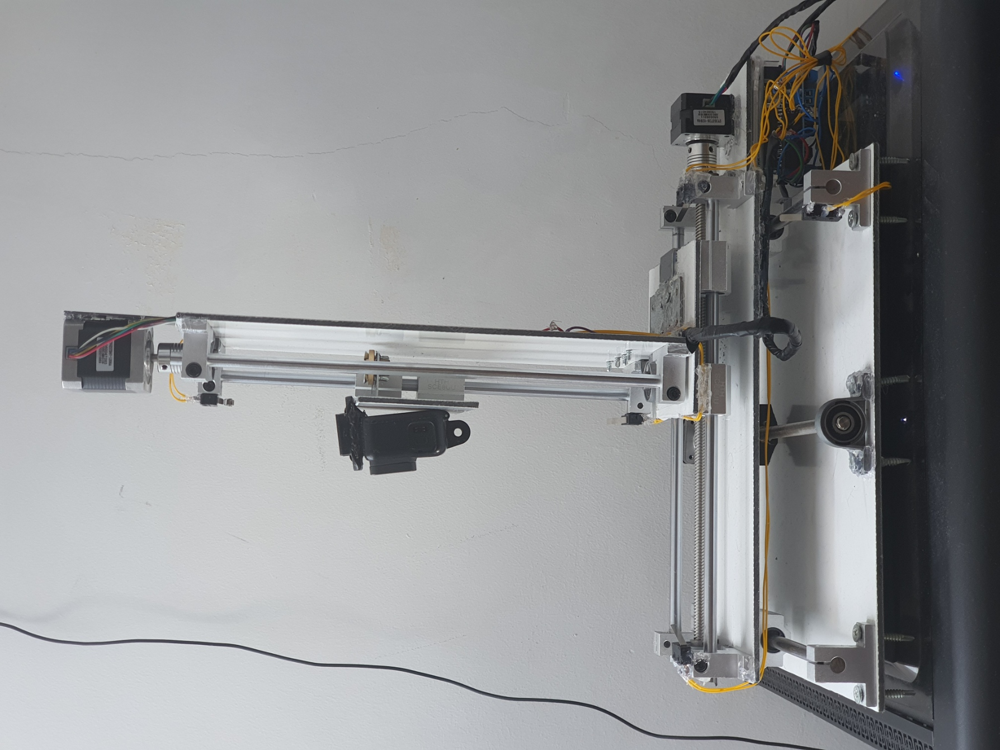
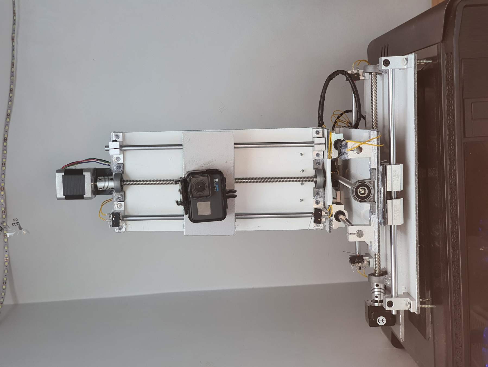
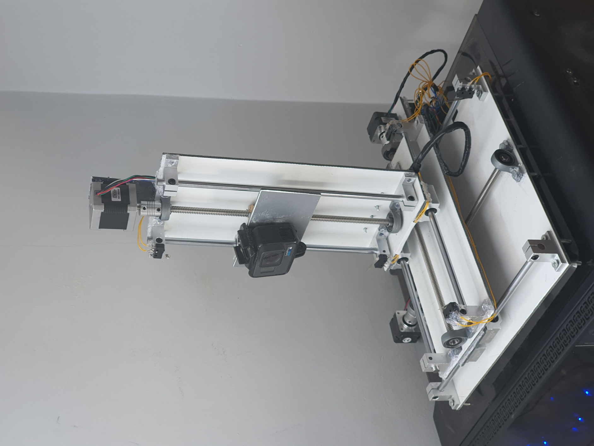
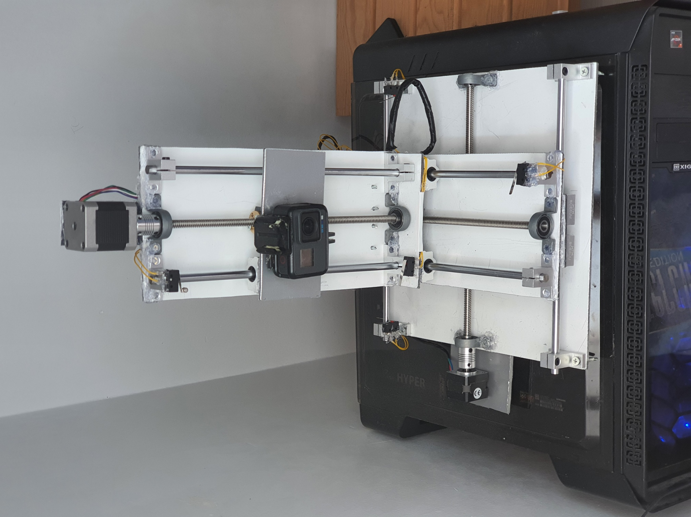

# 3 DOF Cartesian Robot System

This project demonstrates a 3-axis Cartesian robot built for precise linear motion control using **Arduino** and **Processing GUI**.  
It combines **mechanical design**, **electronic control**, and **software communication** to form a complete desktop-scale automation prototype.

---

###  Features
- 3-axis linear motion (X, Y, Z)
- Arduino + Adafruit Motor Shield control
- Processing-based GUI for coordinate input
- Limit switch safety system
- 3D CAD design made in Fusion 360

---

###  Hardware Components
| Component                                      | Quantity |
| ---------------------------------------------- | -------- |
| Stepper Motors (SY35ST26, SY42STH47, SY35ST28) | 3        |
| Arduino Uno                                    | 1        |
| Adafruit Motor Shield v1/v2                    | 2        |
| Shaft Holders                                  | 12       |
| Chrome-plated Rods                             | 6        |
| Trapezoidal Lead Screws                        | 3        |
| Couplers                                       | 3        |
| Linear Bearings                                | 12       |
| Pillow Block Bearings                          | 6        |
| Limit Switches                                 | 3        |

---

###  Software
- **Arduino Code:** [arduino_code.ino](arduino_code/arduino_code.ino)

  Handles serial commands, stepper motor control, and safety checks.

- **Processing Code:** [processing_code.pde](processing_code/processing_code.pde)

  Provides a graphical interface to send XYZ coordinates to Arduino.

---

###  Design
CAD design modeled and assembled in **Fusion 360**.  
Includes linear bearings, lead screws, and a custom aluminum frame.

---

### 🧾 Source
Originally developed as a final project at **Istanbul Sabahattin Zaim University**  
by **Muhammet Hamza Aslan & Furkan Gülseroğlu**, supervised by **Dr. Gökhan Erdemir (2021)**.

Full Turkish report: [final_report_tr.pdf](final_report_tr.pdf)

## 📚 References

1. [How to Make Arduino and Processing IDE Communicate](https://maker.pro/arduino/tutorial/how-to-make-arduino-and-processing-ide-communicate)  
2. [Processing Libraries Reference](https://processing.org/reference/libraries/)  
3. [Processing Forum – Reading Serial String from Arduino](https://forum.processing.org/two/discussion/20226/how-to-read-serial-string-from-arduino-as-int-on-processing)  
4. [Adafruit Motor Shield v2 for Arduino](https://learn.adafruit.com/adafruit-motor-shield-v2-for-arduino)  
5. [Using Stepper Motors with Adafruit Motor Shield](https://learn.adafruit.com/adafruit-motor-shield/using-stepper-motors)  
6. [Adafruit Motor Shield PDF Guide](https://cdn-learn.adafruit.com/downloads/pdf/adafruit-motor-shield.pdf)

